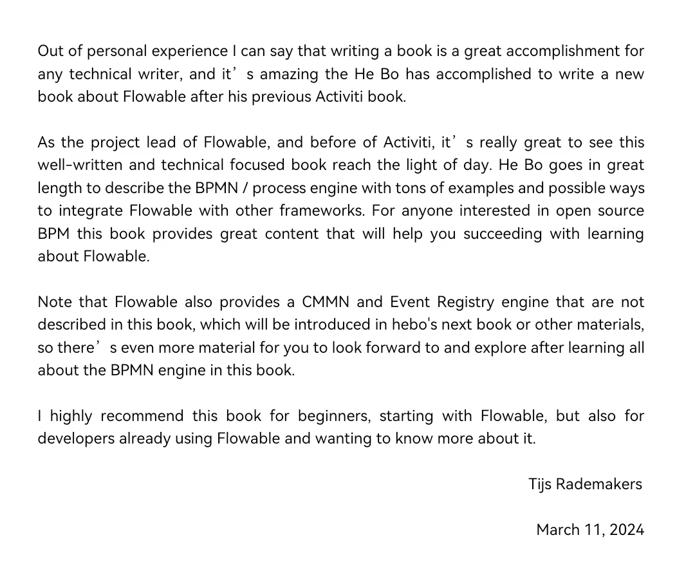
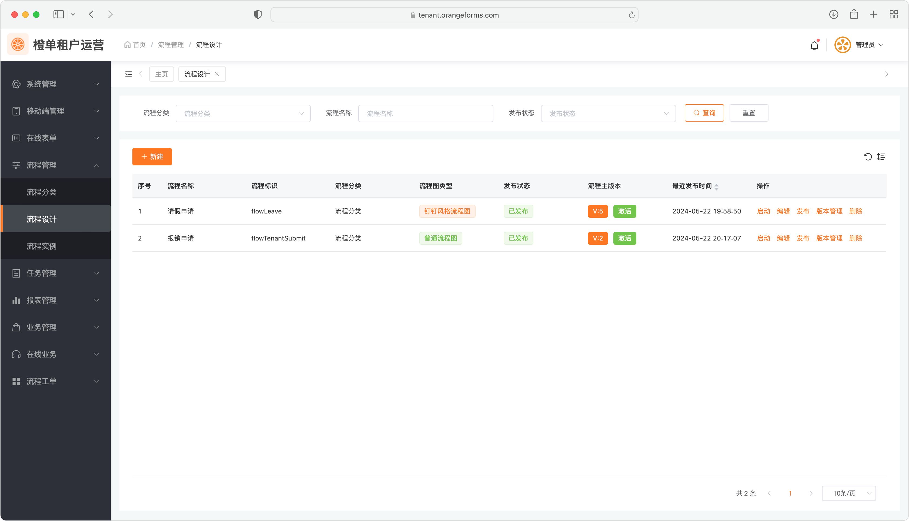
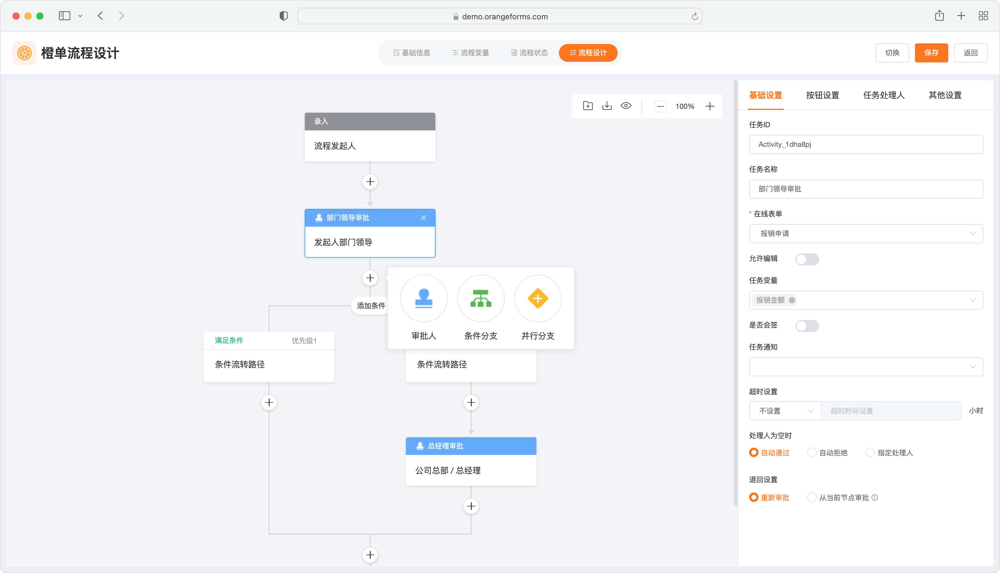
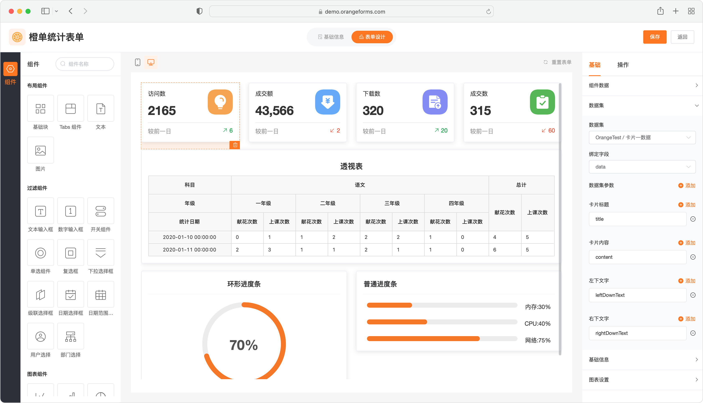
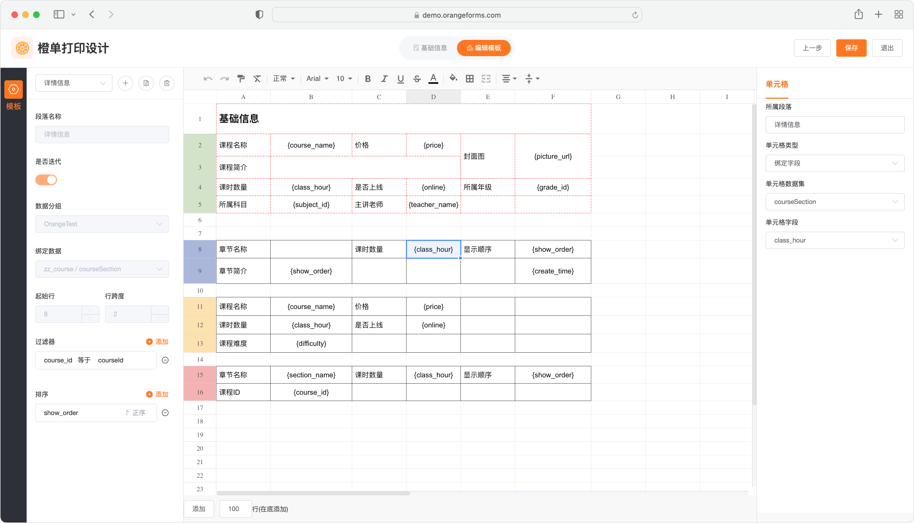

### 橙单开源
- 开源工程绝对保证「开箱即用」和 BUG 极少，全部代码通过 SonarQube 最严格的扫描「0」警告。
- 支持工作流、在线表单、权限框架和数据权限过滤。
- 全部主流技术栈 Spring Boot3 + Flowable7 + Sa-Token + Mybatis-Flex + Mybatis-Plus + Element Plus(Vue3)。
- 后端工程提供基于 Mybatis-Flex 和 Mybatis-Plus 的两个版本，其余功能完全一致。
- 前端提供「高颜值」的表单编辑器和流程编辑器，以及精致统一的前端样式规范。
- 环境搭建文档 [https://www.orangeforms.com/article/open-project-setup](https://www.orangeforms.com/article/open-project-setup)。

### 联系我们
- 70 后创业，无奈行业太卷。真心期望得到您的 Star，让更多同行知道我们的存在。
- 如果您喜欢 QQ 沟通，可以加入我们的 QQ 群 833624889。
- 如果您习惯使用微信，扫码加我微信，拉您入群。

||||
|---|---|---|

### 入群福利
- 结合橙单开源工程和免费的代码生成工具，可在 0 成本投入情况下，让您的项目开发效率提升数倍。
- 提供更多有关代码生成技术和项目上的交流，助您私活儿接到手软。
- 将提供橙单开源与「若依」的集成工程，可使「若依」快速无缝的接入橙单在线表单和工作流等能力。

### 线上资源
- 免费生成指南 [https://www.orangeforms.com/article/free](https://www.orangeforms.com/article/free)
- 免费代码生成 [https://code.orangeforms.com](https://code.orangeforms.com)
- 橙单官方文档 [https://www.orangeforms.com](https://www.orangeforms.com)
- 橙单演示工程 [https://demo.orangeforms.com](https://demo.orangeforms.com)
- 租户管理演示 [https://tenantadmin.orangeforms.com](https://tenantadmin.orangeforms.com)
- 租户运营演示 [https://tenant.orangeforms.com](https://tenant.orangeforms.com)

### 视频分享
- 租户架构应用 [https://www.bilibili.com/video/BV1aZ421g7Zh/?vd_source=83bce1401008f7ee3c485dbbb91cd4c3](https://www.bilibili.com/video/BV1aZ421g7Zh/?vd_source=83bce1401008f7ee3c485dbbb91cd4c3)

### 良心推荐
强烈推荐贺波老师的《深入Activiti流程引擎：核心原理与高阶实战》，该书对系统学习和深入掌握 Activiti/Flowable 极有帮助，书中涵盖很多大型流程中心平台所涉及的技术架构和场景案例。橙单团队作为贺老师的忠实粉丝，我们希望这本书可以帮助到更多对工作流有兴趣的开发者们。
||||
|---|---|---|

### 图和真相

### 感谢支持
非常感谢您的关注。也真心希望能够得到您的 Star，更欢迎入群一起参与技术交流。